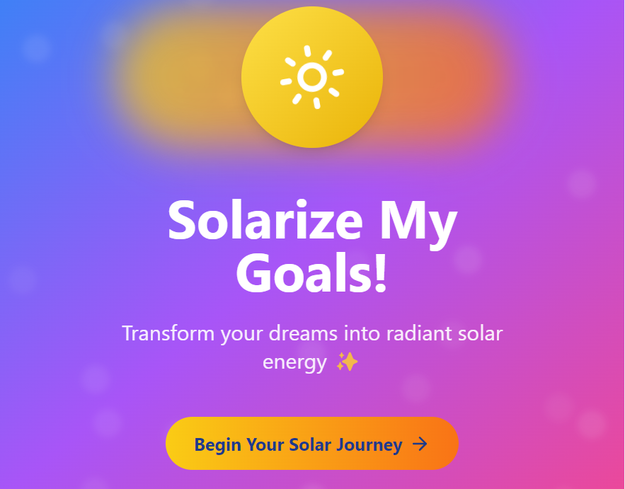
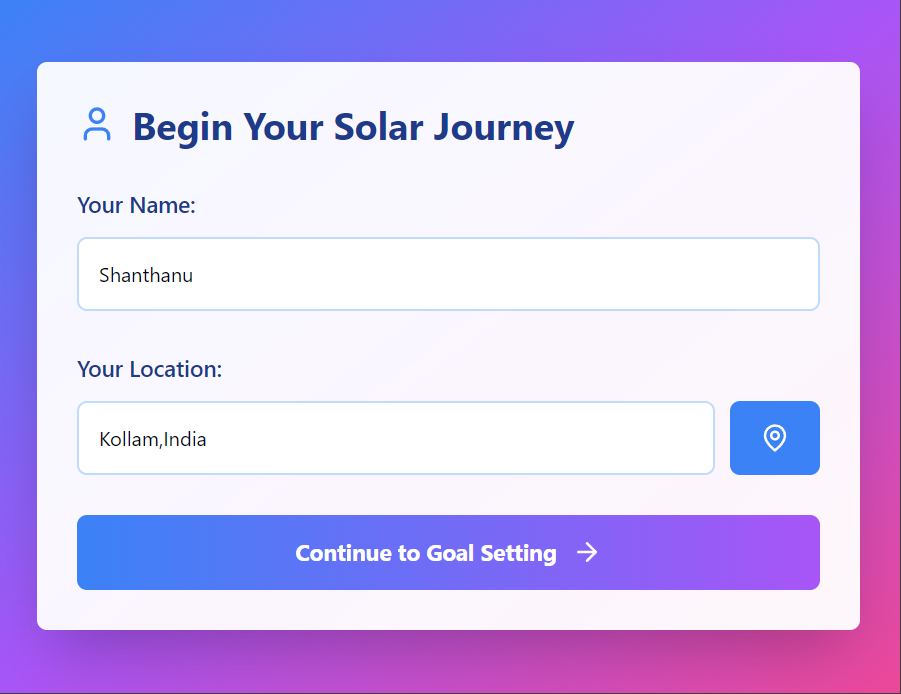
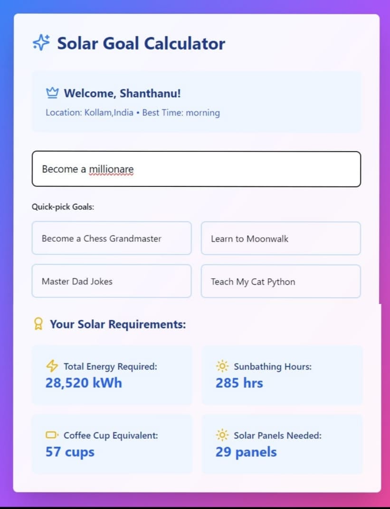
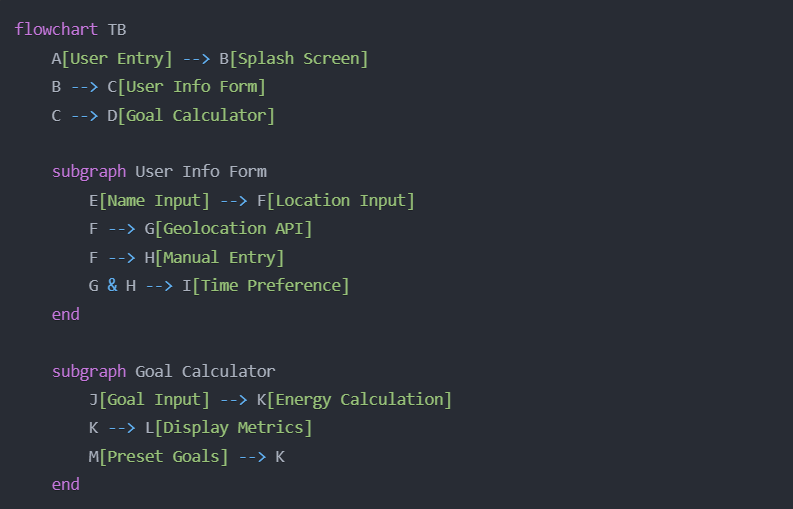

# Solarise your Goals 🎯

## Basic Details
### Team Name: ByteBrigade

### Team Members
- Team Lead: [Shanthanu S Nair] - [TKM College of engineering]
- Member 2: [Shijin Kumar] - [TKM College of engineering]

### Project Description
The Solarize Your Life Goals app is a tongue-in-cheek project that takes user-inputted life ambitions (like “become a rockstar” or “learn to speak whale”) and calculates the amount of imaginary solar energy needed to achieve these dreams. Every life goal, no matter how simple or complex, is hilariously “solarized” into an energy unit—proving just how much sunshine (in kWh) your dreams require!

### The Problem (that doesn't exist)
Today, people underestimate the “solar power” needed to achieve life goals. How much energy is required to “run a marathon” or “launch a cat into space”? The world deserves to know these pointless but highly amusing calculations!

### The Solution (that nobody asked for)
With the Solarize Your Life Goals app, we calculate the solar energy required for any goal. By taking into account factors like the absurdity of the goal, location-based solar potential, and made-up “dream resistance,” we provide users with a unique and completely impractical answer to life’s biggest questions

## Technical Details
### Technologies/Components Used
For Software:
- TypeScript
- Nextjs, React.js
- Tailwind CSS 3.x ,Lucide React, shadcn/ui 
- npm/Node.js,,VS Code ,Chrome DevTools 

For Hardware:
- 

### Implementation
For Software:
# Installation
# Clone the repository
git clone https://github.com/Shanthanu25/SolarTinkerHub-Project.git

# Navigate to project directory
cd solar\solar-goals

# Install dependencies
npm install

# Install required shadcn/ui components
npx shadcn-ui@latest add card
npx shadcn-ui@latest add button

# Run
# Development server
npm run dev

# Build for production
npm run build

# Start production server
npm start

### Project Documentation
For Software:

# Screenshots (Add at least 3)

Splash screen featuring animated sun icon and gradient background. The main entry point of the application with a welcoming message and "Begin Your Solar Journey" button.

User information collection form showing input fields for name, location (with geolocation support), and preferred solar time. Features a clean card-based design with validation.

Main calculator interface displaying user profile, goal input, preset goals, and calculated solar metrics in a grid layout. Shows real-time updates of energy calculations

# Diagrams

The app's workflow begins with user entry on a splash screen, followed by a User Info Form for name, location, and time preferences. Users then enter their goal into the Goal Calculator, which provides a humorous "solar energy needed" calculation with preset goals and custom metrics for a fun, interactive experience.

### Project Demo
# Video
https://drive.google.com/file/d/1d58owAvWrpQ02lHL8qeYZnoLlBGuGvq-/view?usp=drive_link
This demo video showcases the Solarize My Goals app, designed to entertain users by calculating the “solar energy” they’d need to accomplish any life goal in the most absurd and amusing way. The video starts with the User Entry at the splash screen, leading to the User Info Form where users input their name, location, and time preferences. Next, users enter or choose a goal, triggering the Goal Calculator to provide a custom energy estimate based on the unique "solar requirements" for each ambition. This includes a mix of preset goals and tailored inputs, displayed with a lively summary of solar energy metrics. The video wraps up by highlighting energy calculation, making the entire experience both innovative and entertainingly useless.

## Team Contributions
- Shanthanu S Nair: Frontend
- Shijin KUmar: Frontend

---
Made with ❤️ at TinkerHub Useless Projects 

